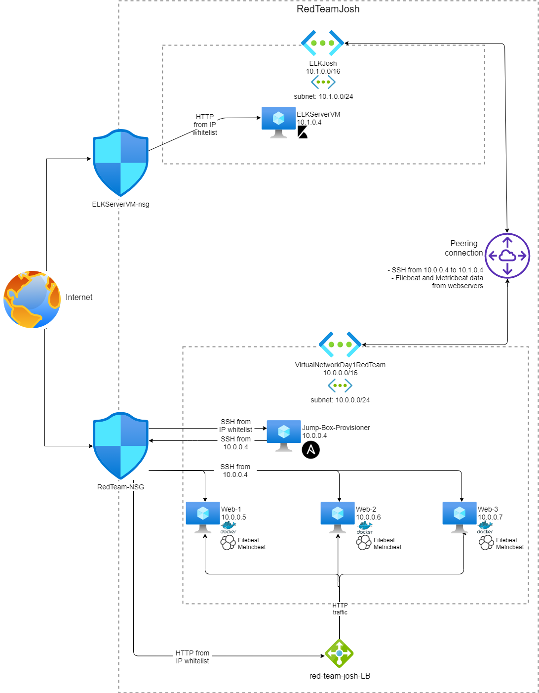
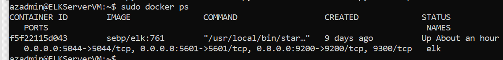

## Automated ELK Stack Deployment

The files in this repository were used to configure the network depicted below.

These files have been tested and used to generate a live ELK deployment on Azure. They can be used to either recreate the entire deployment pictured above. Files are separated to allow for separate installation of:

* ELK: install-elk.yml
* Filebeat: filebeat-playbook.yml
* Metricbeat: metricbeat-playbook.yml

This document contains the following details:
- Description of the Topology
- Access Policies
- ELK Configuration
  - Beats in Use
  - Machines Being Monitored
- How to Use the Ansible Build

### Description of the Topology

The main purpose of this network is to expose a load-balanced and monitored instance of DVWA, the D*mn Vulnerable Web Application.

Load balancing ensures that the application will be highly available, in addition to restricting external access to the network.

Integrating an ELK server allows users to easily monitor the vulnerable VMs for changes to the system logs with Filebeat and fetches metrics from the configured Docker containers with Metricbeat.

The configuration details of each machine may be found below.

| Name                 | Function      | IP Address (Private) | IP Address (Public) | Operating System     |
| -------------------- | ------------- | -------------------- | ------------------- | -------------------- |
| Jump-Box-Provisioner | Gateway       | 10.0.0.4             | Dynamic             | Linux (ubuntu 18.04) |
| Web-1                | Webserver     | 10.0.0.5             |                     | Linux (ubuntu 18.04) |
| Web-2                | Webserver     | 10.0.0.6             |                     | Linux (ubuntu 18.04) |
| Web-3                | Webserver     | 10.0.0.7             |                     | Linux (ubuntu 18.04) |
| ELKServerVM          | ELK server    | 10.1.0.4             | 20.78.1.62          | Linux (ubuntu 18.04) |
| red-team-josh-LB     | Load balancer |                      | 20.53.106.200       |                      |

### Access Policies

The machines on the internal network are not exposed to the public Internet. 

Machines with external access allowed are restricted to the public IP address `120.159.55.141`, and connections only allowed on specific ports:

* The jump box is limited to public SSH on port 22
* The ELK server and load balancer are limited to public HTTP on port 80

Machines within the network can only be accessed via SSH by the jump host from `10.0.0.4`

A summary of the access policies in place can be found in the table below.

| Name          | Publicly Accessible | Allowed IP Addresses                         |
| ------------- | ------------------- | -------------------------------------------- |
| Jump Box      | Yes                 | 120.159.55.141 (port 22)                     |
| Web servers   | No                  | 10.0.0.4 (port 22)                           |
| ELK server    | Yes                 | 120.159.55.141 (port 80), 10.0.0.4 (port 22) |
| Load balancer | Yes                 | 120.159.55.141 (port 80)                     |

### Elk Configuration

The ELK machine is provisioned with Ansible, ensuring that server setup is easily replicated and updated.

The playbook implements the following tasks:
- Install the docker.io and python3-pip modules via apt
- Install the docker module via pip3
- Increase virtual memory, setting `vm.max_map_count` to at least 262144, to allow ELK to run
- Download the docker ELK container and set up to run on ports 5601, 9200 and 5044
- Set ELK service to start on boot

The following screenshot displays the result of running `docker ps` after successfully configuring the ELK instance.

### Target Machines & Beats
This ELK server is configured to monitor the following machines:
- The webservers hosting DVWA, at 10.0.0.5, 10.0.0.6 and 10.0.0.7

We have installed the following Beats on these machines:
- Filebeat 7.6.1
- Metricbeat 7.6.1

These Beats allow us to collect the following information from each machine:
- Filebeat will collect specified log events from the target webservers and index them. Filebeat on this ELK stack has been set up to collect system logs and will return entries from syslog and auth.log
- Metricbeat will collect metrics on specified services on the target webservers. Metricbeat has been set up to collect metrics on Docker. It allows to monitor memory usage and CPU usage for the DVWA containers running on the webservers.

### Using the Playbook
In order to use the playbook, you will need to have an Ansible control node already configured. Assuming you have such a control node provisioned: 

SSH into the control node and follow the steps below:
- Download the playbooks from the `elk-stack/ansible-playbooks` folder in the repository
- Copy the following files from the repository:
  - `install-elk.yml` to `/etc/ansible/`
  - `filebeat-playbook.yml` to `/etc/ansible/roles/filebeat-playbook.yml`
  - `metricbeat-playbook.yml` to `/etc/ansible/roles/metricbeat-playbook.yml`
  - `filebeat-config.yml` to `/etc/ansible/files/filebeat.yml`
  - `metricbeat-config.yml`to `/etc/ansible/files/metricbeat.yml`
- Use `vim` to update `/etc/ansible/hosts` with the following changes:
  - Add groups for [webservers] and [elk] if these do not exist already.
  - Each of your webservers IP addresses under [webservers] section
  - Add the ELK server IP address to the [elk] section
  - This will ensure that each of the playbooks will execute in the correct location
  - For each IP entry, make sure `ansible_python_interpreter=/usr/bin/python3` is specified
  - Save the file with `:wq`
- Run the playbooks:
  - `ansible-playbook /etc/ansible/install-elk.yml`
  - `ansible-playbook /etc/ansible/roles/filebeat-playbook.yml`
  - `ansible-playbook /etc/ansible/roles/metricbeat-playbook.yml`
- SSH into the ELK server and confirm ELK is running with `sudo docker ps`
- Navigate to http://20.78.1.62:5601/ to check that the installation worked as expected and Kibana is running successfully.
